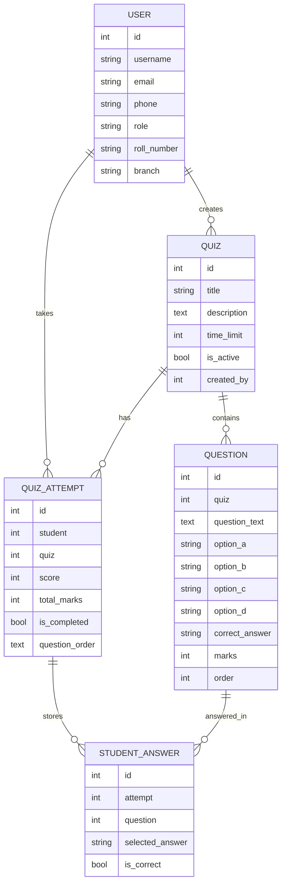

# Quiz Application - Django

A comprehensive quiz application built with Django and PostgreSQL where administrators can create quizzes and students can attempt them.

## Features

### Admin Features
- Create and manage quizzes
- Add questions with multiple choice options
- View student responses and scores
- Export results to Excel or PDF format
- Export questions to PDF or DOCX format
- View detailed analytics

### Student Features
- View available quizzes
- Attempt quizzes (only once per quiz)
- Navigate between questions (Next/Previous)
- Timed quizzes with countdown timer
- Question shuffling for randomized order
- View detailed results after submission
- Quiz history tracking

### Authentication Features
- Separate registration for students and admins
- Role-based access control
- Login with captcha (6-digit random number)
- Password hashing for security
- Profile page with role-based information

## Prerequisites

- Python 3.8 or higher
- PostgreSQL 12 or higher
- pip (Python package manager)

## Installation & Setup

### 1. Install PostgreSQL

Download and install PostgreSQL from https://www.postgresql.org/download/

### 2. Create Database

Open PostgreSQL command line (psql) or pgAdmin and create a database:

```sql
CREATE DATABASE quizesdb;
CREATE USER postgres WITH PASSWORD 'postgres';
GRANT ALL PRIVILEGES ON DATABASE quizesdb TO postgres;
```

**Note:** Update the database credentials in `quiz_project/settings.py` if you use different username/password.

### 3. Install Python Dependencies

```bash
pip install -r requirements.txt
```

### 4. Apply Migrations

```bash
python manage.py makemigrations
python manage.py migrate
```

### 5. Create Superuser (Optional)

```bash
python manage.py createsuperuser
```

### 6. Run Development Server

```bash
python manage.py runserver
```

The application will be available at: http://127.0.0.1:8000/

## Usage Guide

### For Students

1. **Register**: Go to registration page and select "Student" role
   - Fill in: Username, Email, Phone, Roll Number, Branch, Password
   
2. **Login**: Enter username, password, and captcha code

3. **Dashboard**: View available quizzes and quiz history

4. **Take Quiz**: 
   - Click "Take Test" on any available quiz
   - Navigate using Next/Previous buttons
   - Question navigator shows answered questions
   - Timer shows remaining time
   - Questions are presented in shuffled order
   - Submit when done

5. **View Results**: Check detailed results with correct answers

6. **Profile**: View your profile information

### For Admins

1. **Register**: Go to registration page and select "Admin" role
   - Fill in: Username, Email, Phone, Password

2. **Login**: Enter username, password, and captcha code

3. **Dashboard**: View quiz statistics

4. **Create Quiz**:
   - Click "Create New Quiz"
   - Fill in title, description, time limit
   - Add questions with options and correct answer

5. **Manage Questions**:
   - Add multiple questions to a quiz
   - Specify marks for each question
   - Delete questions if needed
   - Export questions to PDF or DOCX format

6. **View Results**:
   - Select a quiz to view results
   - See all student attempts
   - Download as Excel or PDF

## Project Structure

```
quiz/
├── quiz_project/          # Project settings
│   ├── settings.py
│   ├── urls.py
│   └── wsgi.py
├── quiz/                  # Main application
│   ├── models.py         # Database models
│   ├── views.py          # View logic
│   ├── forms.py          # Form definitions
│   ├── urls.py           # URL routing
│   └── admin.py          # Admin configuration
├── templates/            # HTML templates
│   └── quiz/
│       ├── base.html
│       ├── login.html
│       ├── register.html
│       ├── admin_dashboard.html
│       ├── student_dashboard.html
│       ├── add_quiz.html
│       ├── add_questions.html
│       ├── view_results.html
│       ├── take_quiz.html
│       ├── quiz_result.html
│       └── profile.html
├── static/               # Static files (CSS, JS)
├── manage.py
└── requirements.txt
```

## Database Models
The database uses five main tables. The schema below shows the key fields and how each table links to the others.

### Table Structure

| Table | Key Fields | Purpose | Links To |
|---|---|---|---|
| `User` | `id`, `username`, `email`, `phone`, `role`, `roll_number`, `branch` | Stores students and admins in one custom user table | `Quiz.created_by`, `QuizAttempt.student` |
| `Quiz` | `id`, `title`, `description`, `time_limit`, `is_active`, `created_by` | Stores quiz details created by an admin | `User` (creator), `Question.quiz`, `QuizAttempt.quiz` |
| `Question` | `id`, `quiz`, `question_text`, `option_a`, `option_b`, `option_c`, `option_d`, `correct_answer`, `marks`, `order` | Stores MCQ questions for each quiz | `Quiz` |
| `QuizAttempt` | `id`, `student`, `quiz`, `score`, `total_marks`, `is_completed`, `question_order` | Stores one student’s attempt for one quiz | `User`, `Quiz`, `StudentAnswer.attempt` |
| `StudentAnswer` | `id`, `attempt`, `question`, `selected_answer`, `is_correct` | Stores each selected answer inside an attempt | `QuizAttempt`, `Question` |

### Relationship Map



### How The Tables Link

- One `User` can create many `Quiz` records through `Quiz.created_by`.
- One `Quiz` can have many `Question` records through `Question.quiz`.
- One `User` can have many `QuizAttempt` records through `QuizAttempt.student`.
- One `Quiz` can have many `QuizAttempt` records through `QuizAttempt.quiz`.
- One `QuizAttempt` can have many `StudentAnswer` records through `StudentAnswer.attempt`.
- One `Question` can appear in many `StudentAnswer` rows through `StudentAnswer.question`.

## Security Features

- Password hashing using Django's built-in authentication
- CSRF protection
- Login required decorators
- Role-based access control
- Session-based captcha validation

## Technologies Used

- **Backend**: Django 4.2+
- **Database**: PostgreSQL
- **Frontend**: HTML, CSS, JavaScript
- **Export**: openpyxl (Excel), ReportLab (PDF), python-docx (DOCX)

## Default Credentials (if created)

After running migrations, you can create users via registration page or Django admin.

## Troubleshooting

### Database Connection Error
- Ensure PostgreSQL is running
- Check database credentials in `settings.py`
- Verify database exists

### Migration Errors
- Delete migrations folder (except __init__.py)
- Run `python manage.py makemigrations`
- Run `python manage.py migrate`

### Static Files Not Loading
- Run `python manage.py collectstatic`
- Check STATIC_ROOT in settings.py

## Recent Enhancements

- Question shuffling for students
- Enhanced quiz interface with animations
- Exit quiz functionality with confirmation
- Question export to PDF/DOCX formats
- Improved UI/UX with better animations and visual feedback

## Future Enhancements

- Question categories/tags
- Random question selection
- Question banks
- Image support in questions
- Certificate generation
- Email notifications
- Quiz scheduling
- Question difficulty levels
- Negative marking option

## License

This project is open source and available for educational purposes.
## Support

For issues or questions, please create an issue in the repository.
