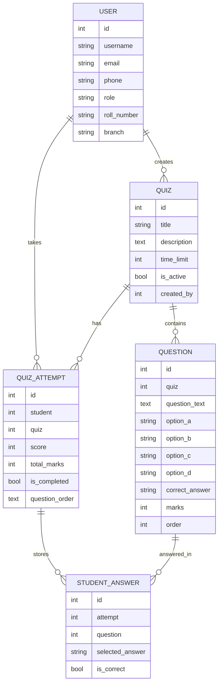

# Quiz Application - Django

> A polished quiz platform built with Django and PostgreSQL for creating, taking, reviewing, and exporting quizzes with role-based access.

[](https://www.djangoproject.com/)
[](https://www.postgresql.org/)
[](https://www.python.org/)

## Overview

This application gives admins a clean workflow to build quizzes, add questions, review student performance, and export results. Students get a timed, single-attempt quiz experience with navigation, progress tracking, and detailed feedback after submission.

## Highlights

| Area | What it includes |
|---|---|
| Admin Dashboard | Quiz creation, question management, score review, exports |
| Student Experience | Timed attempts, previous/next navigation, one-attempt enforcement |
| Authentication | Student/Admin registration, captcha login, password hashing |
| Reporting | Excel export, PDF export, detailed result review |

## Core Features

### Admin Features
- Create and manage quizzes
- Add multiple-choice questions with options A, B, C, and D
- View student responses and scores
- Export results to Excel or PDF
- Export questions to PDF or DOCX
- View quiz analytics and attempt summaries

### Student Features
- View available quizzes
- Attempt quizzes only once per quiz
- Navigate with Next and Previous buttons
- Take timed quizzes with countdown
- Answer shuffled questions in a cleaner interface
- Review detailed results after submission
- Track quiz history over time

### Authentication Features
- Separate registration for students and admins
- Role-based access control
- Login with a 6-digit captcha
- Password hashing for security
- Profile page with role-specific information

## Prerequisites

| Requirement | Recommended |
|---|---|
| Python | 3.8+ |
| PostgreSQL | 12+ |
| Package Manager | `pip` |

> Make sure PostgreSQL is running before you apply migrations.

## Installation & Setup

### Quick Start

1. Install PostgreSQL and create the database.
2. Install Python dependencies.
3. Apply migrations and create a superuser.
4. Start the development server.

### 1. Install PostgreSQL

Download and install PostgreSQL from https://www.postgresql.org/download/

### 2. Create Database

Open PostgreSQL command line (psql) or pgAdmin and create a database:

```sql
CREATE DATABASE quizesdb;
CREATE USER postgres WITH PASSWORD 'postgres';
GRANT ALL PRIVILEGES ON DATABASE quizesdb TO postgres;
```

**Note:** Update the database credentials in `quiz_project/settings.py` if you use different username/password.

### 3. Install Python Dependencies

```bash
pip install -r requirements.txt
```

### 4. Apply Migrations

```bash
python manage.py makemigrations
python manage.py migrate
```

### 5. Create Superuser (Optional)

```bash
python manage.py createsuperuser
```

### 6. Run Development Server

```bash
python manage.py runserver
```

The application will be available at: http://127.0.0.1:8000/

> Tip: For a cleaner first run, create the database and user first, then install packages, then migrate.

## Usage Guide

### For Students

1. **Register**: Go to registration page and select "Student" role
   - Fill in: Username, Email, Phone, Roll Number, Branch, Password
   
2. **Login**: Enter username, password, and captcha code

3. **Dashboard**: View available quizzes and quiz history

4. **Take Quiz**: 
   - Click "Take Test" on any available quiz
   - Navigate using Next/Previous buttons
   - Question navigator shows answered questions
   - Timer shows remaining time
   - Questions are presented in shuffled order
   - Submit when done

5. **View Results**: Check detailed results with correct answers

6. **Profile**: View your profile information

### For Admins

1. **Register**: Go to registration page and select "Admin" role
   - Fill in: Username, Email, Phone, Password

2. **Login**: Enter username, password, and captcha code

3. **Dashboard**: View quiz statistics

4. **Create Quiz**:
   - Click "Create New Quiz"
   - Fill in title, description, time limit
   - Add questions with options and correct answer

5. **Manage Questions**:
   - Add multiple questions to a quiz
   - Specify marks for each question
   - Delete questions if needed
   - Export questions to PDF or DOCX format

6. **View Results**:
   - Select a quiz to view results
   - See all student attempts
   - Download as Excel or PDF

## Project Structure

| Path | Purpose |
|---|---|
| `quiz_project/` | Django project configuration, routing, and WSGI entrypoint |
| `quiz/` | Core app containing models, views, forms, URLs, and admin configuration |
| `templates/quiz/` | UI templates for login, dashboards, quizzes, results, and profile pages |
| `static/` | Shared CSS, JavaScript, and image assets |
| `manage.py` | Django management entrypoint |
| `requirements.txt` | Python dependency list |

### Key Application Files

| File | Role |
|---|---|
| `quiz/models.py` | Defines users, quizzes, questions, attempts, and answers |
| `quiz/views.py` | Handles quiz flow, results, exports, and authentication logic |
| `quiz/forms.py` | Contains the form definitions used across the app |
| `quiz/urls.py` | Routes app-specific URLs |
| `quiz/admin.py` | Registers models in Django admin |

> The codebase is organized to keep the quiz flow cleanly separated from presentation and data storage.

## Database Models
The database uses five main tables. The schema below shows the key fields and how each table links to the others.

### Table Structure

| Table | Key Fields | Purpose | Links To |
|---|---|---|---|
| `User` | `id`, `username`, `email`, `phone`, `role`, `roll_number`, `branch` | Stores students and admins in one custom user table | `Quiz.created_by`, `QuizAttempt.student` |
| `Quiz` | `id`, `title`, `description`, `time_limit`, `is_active`, `created_by` | Stores quiz details created by an admin | `User` (creator), `Question.quiz`, `QuizAttempt.quiz` |
| `Question` | `id`, `quiz`, `question_text`, `option_a`, `option_b`, `option_c`, `option_d`, `correct_answer`, `marks`, `order` | Stores MCQ questions for each quiz | `Quiz` |
| `QuizAttempt` | `id`, `student`, `quiz`, `score`, `total_marks`, `is_completed`, `question_order` | Stores one student’s attempt for one quiz | `User`, `Quiz`, `StudentAnswer.attempt` |
| `StudentAnswer` | `id`, `attempt`, `question`, `selected_answer`, `is_correct` | Stores each selected answer inside an attempt | `QuizAttempt`, `Question` |

### Relationship Map



### How The Tables Link

- One `User` can create many `Quiz` records through `Quiz.created_by`.
- One `Quiz` can have many `Question` records through `Question.quiz`.
- One `User` can have many `QuizAttempt` records through `QuizAttempt.student`.
- One `Quiz` can have many `QuizAttempt` records through `QuizAttempt.quiz`.
- One `QuizAttempt` can have many `StudentAnswer` records through `StudentAnswer.attempt`.
- One `Question` can appear in many `StudentAnswer` rows through `StudentAnswer.question`.

## Security Features

| Security Layer | Implementation |
|---|---|
| Password storage | Django's built-in password hashing |
| Form protection | CSRF tokens on all forms |
| Access control | `login_required` and role checks |
| Login validation | Session-based 6-digit captcha |
| Session handling | Django session middleware |

## Technologies Used

| Layer | Stack |
|---|---|
| Backend | Django 5.2.8 |
| Database | PostgreSQL |
| Frontend | HTML, CSS, JavaScript |
| Excel Export | openpyxl |
| PDF Export | ReportLab |
| DOCX Export | python-docx |

## Deployment

> Recommended production setup: PythonAnywhere for hosting the app, PostgreSQL for data, and a secure environment-based `DATABASE_URL`.

### Suggested Runtime Settings

| Setting | Value |
|---|---|
| `DEBUG` | `False` |
| `ALLOWED_HOSTS` | Your PythonAnywhere domain |
| `CSRF_TRUSTED_ORIGINS` | Your HTTPS domain |
| `DATABASE_URL` | External PostgreSQL connection string |

### Deployment Notes

- Run `python manage.py collectstatic --noinput` before reloading the app.
- Set your production secret key and database credentials through environment variables.
- If you are tunneling PostgreSQL through ngrok, keep the tunnel running while the app is online.

## Default Credentials (if created)

After running migrations, create users through the registration page or Django admin. There are no built-in default credentials.

## Troubleshooting

### Database Connection Error
| Check | What to verify |
|---|---|
| PostgreSQL service | Confirm the server is running |
| Credentials | Verify username, password, host, and port |
| Database name | Confirm the target database exists |
| Tunneling | If using ngrok, confirm the tunnel is active |

### Migration Errors
| Step | Action |
|---|---|
| 1 | Keep `__init__.py` and clear only broken migration files if needed |
| 2 | Run `python manage.py makemigrations` |
| 3 | Run `python manage.py migrate` |

### Static Files Not Loading
| Check | Action |
|---|---|
| Build assets | Run `python manage.py collectstatic` |
| Static root | Confirm `STATIC_ROOT` is configured correctly |
| Web config | Verify static mapping on PythonAnywhere |

## Recent Enhancements

| Enhancement | Result |
|---|---|
| Question shuffling | More varied quiz attempts |
| Animated quiz UI | Better visual feedback |
| Exit confirmation | Fewer accidental exits |
| PDF/DOCX exports | Easier offline sharing |
| UI polish | Cleaner interactions and layout flow |

## Future Enhancements

| Idea | Benefit |
|---|---|
| Question categories/tags | Better quiz organization |
| Random question selection | Stronger assessment variety |
| Question banks | Easier reuse of content |
| Image support in questions | Richer question formats |
| Certificate generation | Better completion rewards |
| Email notifications | Improved user communication |
| Quiz scheduling | Controlled quiz availability |
| Difficulty levels | More precise assessment design |
| Negative marking | More advanced scoring options |

## License

This project is open source and available for educational purposes.

---

If you want a more interactive presentation, the next step would be turning this README into a full landing-page style document with icons, section banners, and a screenshot gallery.
## Support

For issues or questions, please create an issue in the repository.
